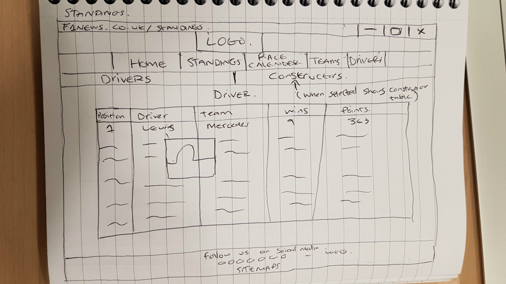
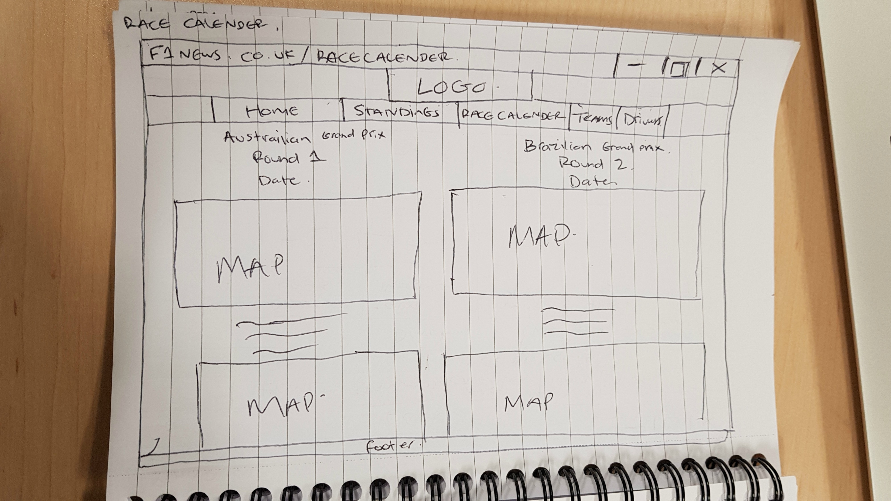
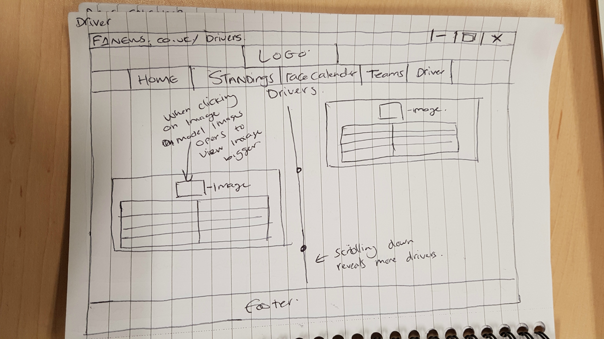
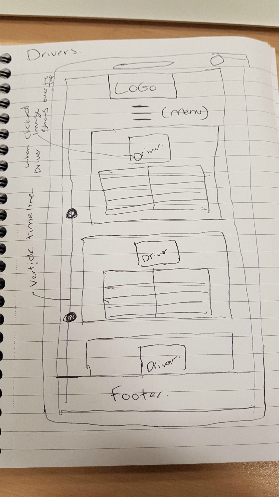

# F1 News

F1 news is a wesbite which provides details on the current standings of drivers/constrcutors. Details of all drivers, teams and latest news. The wesbite has been created with **HTML5**, **CSS** and **Javascript**

The website is made up of a series of pages - how? nav bar takes to different pages etc..

upload image to show its series of pages 

# Wireframes
**Desktops**
 
 
 

  

**Mobile**
 
 
 

  

# Issues 

Timeline not mobile first - how you resolved this
Modal image
Alt tag issue
HTML errors
Css Errors

# User Testing 

# References

https://webdesign.tutsplus.com/tutorials/building-a-vertical-timeline-with-css-and-a-touch-of-javascript--cms-26528
https://www.w3schools.com/css/css3_images.asp
https://stackoverflow.com/questions/42526143/how-to-open-a-modal-image-for-multiple-images
https://stackoverflow.com/questions/12627443/jquery-click-vs-onclick/12627478#12627478
http://cssmenumaker.com/blog/stylish-css-tables-tutorial/
https://codepen.io/mastastealth/pen/BHJLb
http://www.color-hex.com/color/dfdfdf
https://daveeveritt.github.io/flexbox-cheatsheet/
Week 4 Lab 
