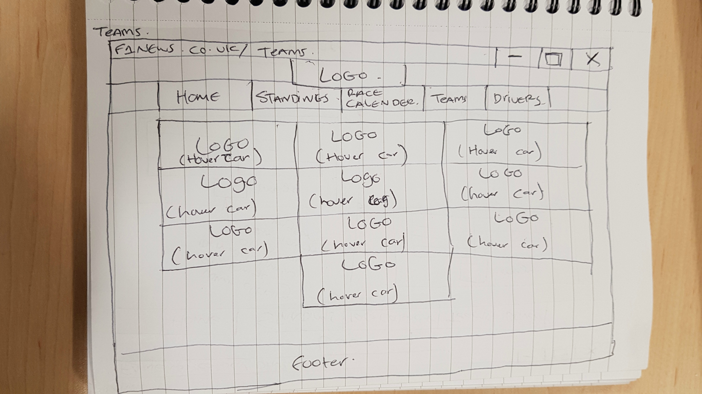

# F1 News

F1 news is a wesbite which provides details on the current standings of drivers/constrcutors. Details of all drivers, teams and latest news. The wesbite has been created with **HTML5**, **CSS** and **Javascript**

The website is made up of a series of pages as each page has its one page eg. homepage is index.html, Drivers is drivers.html and so on. The Nav bar also needs to reload as each page is loaded. 

Below is a screenshot of the navigation bar which shows each page is seprate.

# Wireframes
**Desktops**
Homepage
 
Standings
 
Race Calender
 
Teams

Drivers
  

**Mobile**
Home
 
Standings

Race Calender
 
Teams

Drivers
  

# Issues 

**Timeline not mobile first** - 
The original timeline css code was desktop first so I had to rearranage it so it's mobile first. for this I needed to understand what each css code was doing in order to rearrange it to be mobile first. I did this by trial and error and trying to understand what each bit of the css was doing.
**Modal image** - 
The W3Schools website shows how to do the modal image however it only works for one I tried to change the javascript to use different id's on the html and css however this only allowed for multiple images to load but didnt allow me to close the modal image. I used a forum (stackoverflow) which recomended using a event listener this allowed me to open multiple images and close them.

HTML, CSS errors are shown on a seperate errors document.

# User Testing 
User testing on seperate document called testing.doc

# References
Used for timeline 
https://webdesign.tutsplus.com/tutorials/building-a-vertical-timeline-with-css-and-a-touch-of-javascript--cms-

Used for image styling and modal image
https://www.w3schools.com/css/css3_images.asp

Used for help for multiple modal images
https://stackoverflow.com/questions/42526143/how-to-open-a-modal-image-for-multiple-images

Used for event listener instead of onclick
https://stackoverflow.com/questions/12627443/jquery-click-vs-onclick/12627478#12627478

CSS for table used in standings
http://cssmenumaker.com/blog/stylish-css-tables-tutorial/

CSS for table used in standings
https://codepen.io/mastastealth/pen/BHJLb

Used to get hex code for different colours
http://www.color-hex.com/color/dfdfdf

used for flexbox on home page. 
https://daveeveritt.github.io/flexbox-cheatsheet/

Used for mobile responsive 
Week 4 Lab for mobile responsive

Used for slideshow on homepage for teams
Week 7 Slide show

Used for slide show on homepage
https://www.w3schools.com/w3css/w3css_slideshow.asp

Used for Google Maps API
https://developers.google.com/maps/
